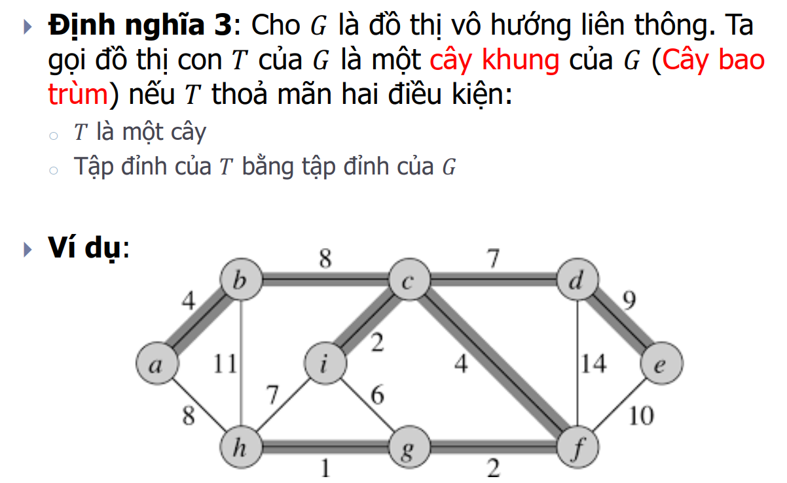
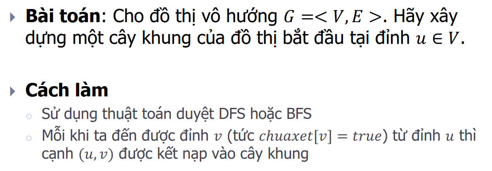
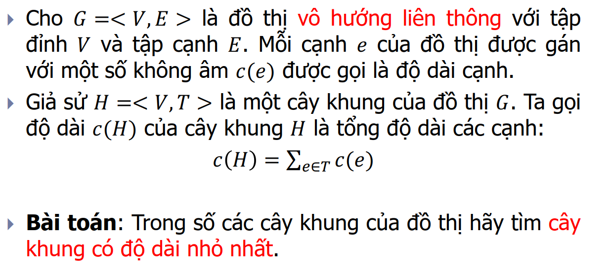
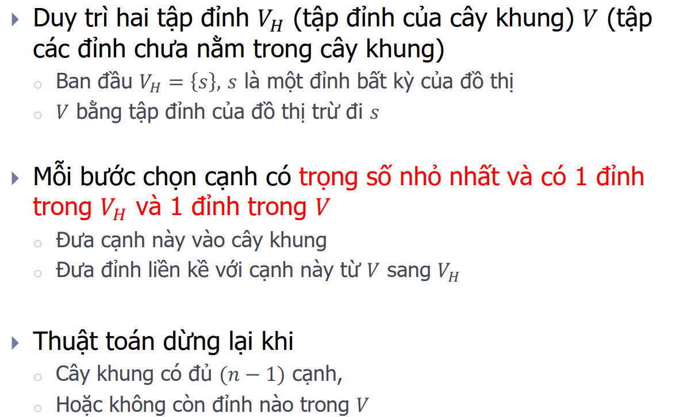
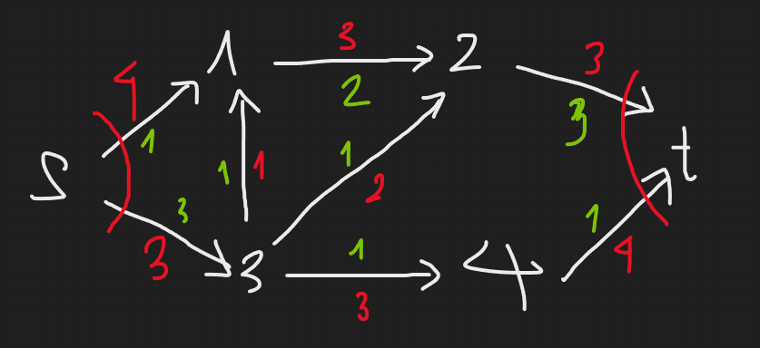
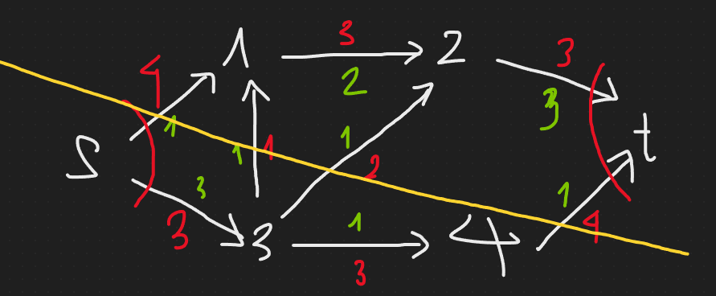
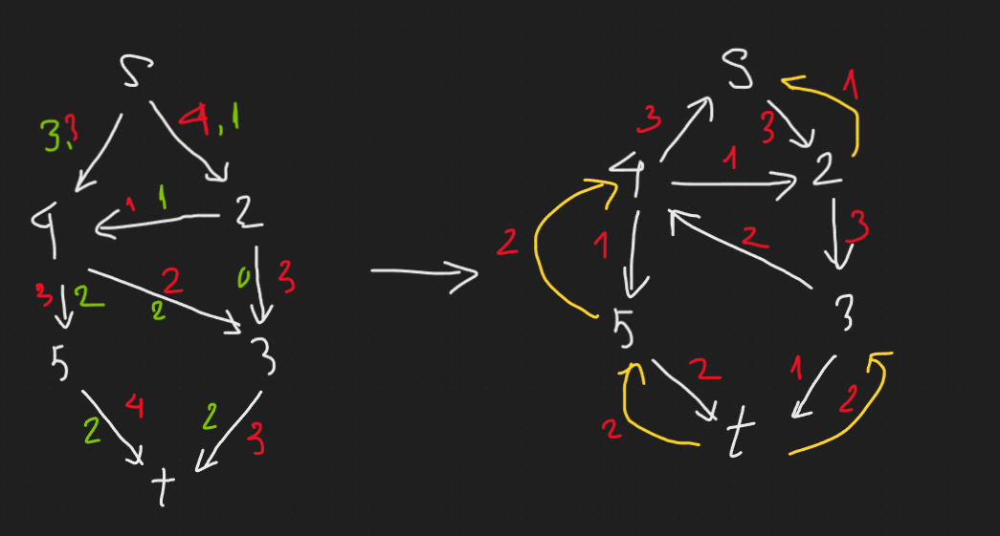
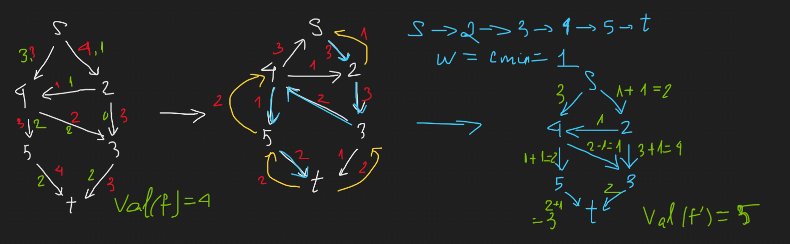

<details>
<summary><h1>Các khái niệm cơ bản của lý thuyết đồ thị</h1></summary>
<p>

<details>
<summary><h2>Định nghĩa đồ thị</h2></summary>
<p>

- Đơn đồ thị vô hướng: 
- Đa đồ thị vô hướng: 
- Giả đồ thị vô hướng: 
- Đơn đồ thị có hướng: 
- Đa đồ thị có hướng: 
</p>
</details>

<details>
<summary><h2>Một số thuật ngữ cơ bản trên đồ thị vô hướng</h2></summary>
<p>

- Bậc của đỉnh, đỉnh cô lập, đỉnh treo: 
- Định lý về tổng bậc các đỉnh: 
- Đường đi, chu trình: 
Ví dụ: 
- Liên thông: 
Ví dụ: 
- Cầu, trụ: 
</p>
</details>

<details>
<summary><h2>Một số thuật ngữ cơ bản trên đồ thị có hướng</h2></summary>
<p>

- Bán bậc của đỉnh
    - Kí hiệu bán bậc ra của đỉnh v: `deg+(v)`
    - Kí hiệu bán bậc vào của đỉnh v: `deg-(v)`

Ví dụ: 
- Định lý về tổng bán bậc các đỉnh: 
- Đường đi, chu trình: như đồ thị vô hướng
- Liên thông mạnh, liên thông yếu: 
- Định chiều được: 
</p>
</details>

<details>
<summary><h2>Một số dạng đồ thị đặc biệt</h2></summary>
<p>

- Đồ thị đầy đủ: 
- Đồ thị vòng: 
- Đồ thị bánh xe: 
- Đồ thị hai phía: 
</p>
</details>

</p>
</details>

<details>
<summary><h1>Biểu diễn đồ thị trên máy tính</h1></summary>
<p>

<details>
<summary><h2>Biểu diễn đồ thị bằng ma trận kề</h2></summary>
<p>

- Ma trận kề của đồ thị vô hướng: 
- Tính chất của ma trận kề đối với đồ thị vô hướng: 
- Ma trận kề của đồ thị có hướng: 
- Tính chất của ma trận kề đối với đồ thị có hướng: 
- Ưu và nhược điểm: 
- Ma trận trọng số: 
</p>
</details>

<details>
<summary><h2>Biểu diễn đồ thị bằng ma trận liên thuộc</h2></summary>
<p>

- Đồ thị vô hướng: 
- Đồ thị có hướng: 
</p>
</details>

<details>
<summary><h2>Biểu diễn đồ thị bằng danh sách cạnh</h2></summary>
<p>

- Ưu và nhược điểm: 
</p>
</details>

<details>
<summary><h2>Biểu diễn đồ thị bằng danh sách kề</h2></summary>
<p>

- Ưu và nhược điểm: 
</p>
</details>

</p>
</details>

<details>
<summary><h1>Tìm kiếm trên đồ thị</h1></summary>
<p>

<details>
<summary><h2>DFS + BFS</h2></summary>
<p>

- Độ phức tạp thuật toán:
    - Biểu diễn bằng ma trận kề: `O(n^2)`
    - Biểu diễn bằng danh sách cạnh: `O(n.m)`
    - Biểu diễn bằng danh sách kề: `O(max(n, m))`
- Chú ý:
    - Đồ thị vô hướng: Với DFS(u) = BFS(u) = V -> đồ thị liên thông
    - Đồ thị có hướng: Với DFS(u) = BFS(u) = V -> đồ thị liên thông yếu

    Trong đó V là tập các đỉnh

</p>
</details>

<details>
<summary><h2>Ứng dụng</h2></summary>
<p>

- Duyệt tất cả các đỉnh của đồ thị
- Duyệt tất cả các thành phần liên thông của đồ thị
- Tìm đường đi từ đỉnh s đến đỉnh t trên đồ thị

Code: [Đường đi trên đồ thị](./code/duong%20di%20tren%20do%20thi)
- Kiểm tra tính liên thông mạnh của đồ thị bằng thuật toán Kosaraju

Code: [Đếm số thành phần liên thông mạnh](./code/dem%20so%20thanh%20phan%20lien%20thong%20manh)
- Duyệt các đỉnh trụ, cạnh cầu của đồ thị

Code: [Duyệt đỉnh trụ, cạnh cầu](./code/khop%20va%20cau)
- Bài toán định chiều đồ thị
    - Định nghĩa: 
    - Định lý: 
</p>
</details>

</p>
</details>

<details>
<summary><h1>Đồ thị Euler và Hamilton</h1></summary>
<p>

<details>
<summary><h2>Đồ thị Euler (đi qua các cạnh của đồ thị 1 lần)</h2></summary>
<p>

- Khái niệm và ví dụ:  
- Điều kiện cần và đủ để đồ thị là Euler:
    - Đồ thị vô hướng liên thông: mọi đỉnh của đồ thị đều có bậc chẵn
    - Đồ thị có hướng liên thông yếu: tất cả các đỉnh đều có bán bậc ra bằng bán bậc vào (đồ thị liên thông mạnh)
- Điều kiện cần và đủ để đồ thị là nửa Euler:
    - Đồ thị vô hướng liên thông: đồ thị có 0 hoặc 2 đỉnh bậc lẻ
    - Đồ thị có hướng liên thông yếu:
        - Tồn tại đúng hai đỉnh 𝑢, 𝑣 ∈ 𝑉 sao cho 𝑑𝑒𝑔+(𝑢) − 𝑑𝑒𝑔−(𝑢) = 𝑑𝑒𝑔−(𝑣) − deg+(𝑣) = 1
        - Các đỉnh 𝑠 ≠ 𝑢, 𝑠 ≠ 𝑣 còn lại có 𝑑𝑒𝑔+(𝑠) = 𝑑𝑒𝑔−(𝑠)
        - Đường đi Euler sẽ xuất phát tại đỉnh 𝑢 và kết thúc tại đỉnh 𝑣

Code: [Euler](./code/euler)
</p>
</details>

<details>
<summary><h2>Đồ thị Hamilton (đi qua các đỉnh của đồ thị 1 lần)</h2></summary>
<p>

- Khái niệm và ví dụ: 
- Chưa có thuật toán hiệu quả để kiểm tra xem 1 đồ thị có phải Hamilton không.

Code: [Hamilton](./code/hamilton)
</p>
</details>

</p>
</details>

<details>
<summary><h1>Spanning Trees</h1></summary>
<p>

<details>
<summary><h2>Cây và các tính chất của cây</h2></summary>
<p>

- Định nghĩa: 
- Các tính chất của cây: 
</p>
</details>

<details>
<summary><h2>Cây khung của đồ thị</h2></summary>
<p>

- Định nghĩa: 
- Xây dựng cây khung của đồ thị: 
</p>
</details>

<details>
<summary><h2>Bài toán cây khung nhỏ nhất</h2></summary>
<p>

- Phát biểu bài toán: 
- Ví dụ:
    - Bài toán nối mạng máy tính: Một mạng máy tính gồm 𝑛 máy tính được đánh số từ 1, 2, . . . , 𝑛. Biết chi phí nối máy 𝑖 với máy 𝑗 là 𝑐[𝑖, 𝑗], 𝑖, 𝑗 = 1, 2, . . . , 𝑛. Hãy tìm cách nối mạng sao cho chi phí là nhỏ nhất.
    - Bài toán xây dựng hệ thống cáp: Giả sử ta muốn xây dựng một hệ thống cáp điện thoại nối 𝑛 điểm của một mạng viễn thông sao cho điểm bất kỳ nào trong mạng đều có đường truyền tin tới các điểm khác. Biết chi phí xây dựng hệ thống cáp từ điểm 𝑖 đến điểm 𝑗 là 𝑐[𝑖, 𝑗]. Hãy tìm cách xây dựng hệ thống mạng cáp sao cho chi phí là nhỏ nhất.
- Thuật toán Kruskal: 
```
Tóm tắt: Áp dụng DSU để code
Bước 1: Khởi tạo và sắp xếp các cạnh theo trọng số tăng dần
Bước 2: Xét các cạnh (x, y): nếu x, y khác cha thì thêm vào cây khung, không thì bỏ
Bước 3: In ra kết quả
```

Code: [Thuật toán Kruskal](./code/cay%20khung%20nho%20nhat/kruskal)
- Thuật toán Prim: 
```
Tóm tắt:
Gọi V = {1...n}, V(MST) = NULL
Bước 1: Khởi tạo: Thêm đỉnh u vào V(MST) và loại u khỏi V
Bước 2: Lặp: Chừng nào V khác rỗng thì tìm cạnh ngắn nhất e = (x, y) với x thuộc V, y thuộc V(MST) và thêm cạnh e vào cây khung, đồng thời loại đỉnh x khỏi V và thêm x vào V(MST)
Bước 3: In ra kết quả
```

Code: [Thuật toán Prim](./code/cay%20khung%20nho%20nhat/prim)
</p>
</details>

</p>
</details>

<details>
<summary><h1>Shortest Path</h1></summary>
<p>

<details>
<summary><h2>Bài toán tìm đường đi ngắn nhất</h2></summary>
<p>

- Trường hợp 1: s cố định, t thay đổi
    - Đồ thị ko có trọng số âm: Dijkstra
    - Đồ thị có trọng số âm nhưng ko có chu trình âm: Bellman-Ford
    - Đồ thị có chu trình âm: Ko có lời giải
- Trường hợp 2: s thay đổi và t thay đổi
    - Đồ thị ko có trọng số âm: lặp lại n lần Dijkstra
    - Đồ thị ko có chu trình âm: Floyd
</p>
</details>

<details>
<summary><h2>Thuật toán Dijkstra</h2></summary>
<p>

- Mục đích:
    - Tìm đường đi ngắn nhất từ 1 đỉnh s tới các đỉnh còn lại.
    - Áp dụng cho đồ thị có hướng với trọng số ko âm.

Code: [Thuật toán Dijkstra](./code/duong%20di%20ngan%20nhat/dijkstra)
</p>
</details>

<details>
<summary><h2>Thuật toán Bellman-Ford</h2></summary>
<p>

- Mục đích:
    - Tìm đường đi ngắn nhất từ 1 đỉnh s tới các đỉnh còn lại.
    - Áp dụng cho đồ thị có hướng và không có chu trình âm (có thể có cạnh âm).
</p>
</details>

<details>
<summary><h2>Thuật toán Floyd</h2></summary>
<p>

- Mục đích:
    - Tìm đường đi ngắn nhất giữa tất cả các cặp đỉnh của đồ thị.
    - Áp dụng cho đồ thị có hướng và không có chu trình âm (có thể có cạnh âm).
</p>
</details>

</p>
</details>

<details>
<summary><h1>Bài toán luồng cực đại trong mạng</h1></summary>
<p>

<details>
<summary><h2>Định nghĩa</h2></summary>
<p>

- Mạng: Mạng là đồ thị có hướng, có trọng số e(u, v) thoả mãn:
    - Có duy nhất 1 đỉnh s không có cung đi vào gọi là điểm phát
    - Có duy nhất 1 đỉnh t không có cung đi ra gọi là điểm thu
    - Trọng số e(u, v) là số thực được gọi là khả năng thông qua của cung (nếu không có cung thì khả năng thông qua = 0), kí hiệu `c(u, v)`

- Luồng: Luồng f trong mạng G là ánh xạ `f: E → R+`. Gán cho mỗi cung e 1 số thực không âm `f(e) = f(u, v)`, gọi là luồng trên cung e, thoả mãn:
    - Luồng trên cung e không vượt quá khả năng thông qua của nó: 0 ≤ f(e) ≤ c(u, v)
    - Với mọi đỉnh khác s, t: Tổng luồng cung đi vào = Tổng luồng cung đi ra:
    $\sum f(u,v) = \sum f(v, u)$
    - Giá trị của luồng f: là tổng cung đi ra của s, hoặc tổng cung đi vào của t:
    $val(f) = \sum f(s, u) = \sum f(u, s)$

Ví dụ: 
    
    Trong đó: Đỏ: Khả năng thông qua (Trọng số). Xanh: Luồng

Giải thích:

    1. Thoả mãn mọi luồng cung đều nhỏ hơn khả năng thông qua của cung đó
    2. Tổng luồng cung đi vào = Tổng luồng cung đi ra
        Đỉnh 1: 1 + 1 = 2
        Đỉnh 2: 2 + 1 = 3
        Đỉnh 3: 3 = 1 + 1 + 1
        Đỉnh 4: 1 = 1
    3. val(f) = 1 + 3 = 3 + 1 = 4

- Lát cắt: Lát cắt chia đồ thị thành 2 tập hợp X, X* sao cho s thuộc X, t thuộc X*. Khả năng thông qua của lát cắt (X, X*):
    $c(X, X^*) = \sum c(v, w)$, v thuộc X, w thuộc X*
    c(X, X*) min được gọi là lát cắt hẹp nhất

Giá trị của mọi luồng 𝑓 trong mạng luôn nhỏ hơn hoặc bằng khả năng thông qua của lát cắt (𝑋,𝑋∗) bất kỳ trong mạng

Ví dụ: 

Xét lắt cắt (X, X*) trong đó X = {s, 3, 4}, X* = {1, 2, t}
Khi đó c(X, X*) = c(s, 1) + c(3, 1) + c(3, 2) + c(4, t) = 11

- Đồ thị tăng luồng: Cho mạng G, ta sẽ xây dựng đồ thị tăng luồng G’ theo tiêu chí sau:
Xét cung e(u, v):
    - Nếu `f(e) = 0` → Giữ nguyên cung
    - Nếu `f(e) = c(u, v)` → Đảo hướng của cung
    - Nếu `0 ≤ f(e) ≤ c(e)` → Cập nhật cung với trọng số `c(e) - f(e)`, thêm 1 cung ngược hướng với trọng số `f(e)`

Ví dụ: 

Các cung giữ nguyên từ đồ thị trước thì gọi là cung thuận, còn các cung mới (kể cả đảo hướng) là cung nghịch

- Tăng luồng theo đường đi: 
    - Xét `P = (s = v0, v1,… = t)` là đường đi từ s đến trên đồ thị tăng luồng G’
    - Ta gọi $\omega$ là giá trị nhỏ nhất trong các cung trên đường đi P
    - Về lại đồ thị ban đầu G, ta cập nhật như sau:
        - f’(u, v) = f(u, v) + $\omega$ nếu là cung thuận
        - f’(u, v) = f(u, v) - $\omega$ nếu là cung nghịch
        - f’(u, v) = f(u, v) nếu cung không trên đường đi P

Ví dụ: 

- Đường tăng luồng: Đường tăng luồng 𝑓 là một đường đi bất kỳ từ 𝑠 đến 𝑡 trong đồ thị tăng luồng G’

Định lý 1: Các mệnh đề sau là tương đương:

    - 𝑓 là luồng cực đại trong mạng
    - Không tìm được đường tăng luồng 𝑓
    - 𝑣𝑎𝑙(𝑓) = 𝑐(𝑋,𝑋∗) với một lát cắt (𝑋,𝑋∗) nào đó
</p>
</details>

<details>
<summary><h2>Thuật toán Ford - Fulkerson</h2></summary>
<p>

Ví dụ: 

- Bắt đầu từ một luồng 𝑓 bất kỳ - có thể là luồng 0
- Xây dựng đồ thị tăng luồng 𝐺’
- Từ 𝐺’, tìm đường tăng luồng 𝑃:
    - Nếu không có đường tăng luồng nào thì kết thúc
    - Nếu có đường tăng luồng 𝑃 thì xây dựng luồng mới 𝑓’ và lặp lại quá trình trên cho đến khi không tìm thêm được đường tăng luồng mới

Để tìm đường tăng luồng trong 𝐺𝑓 có thể sử dụng thuật toán tìm kiếm theo chiều rộng (hoặc theo chiều sâu) bắt đầu từ đỉnh 𝑠.
</p>
</details>

</p>
</details>